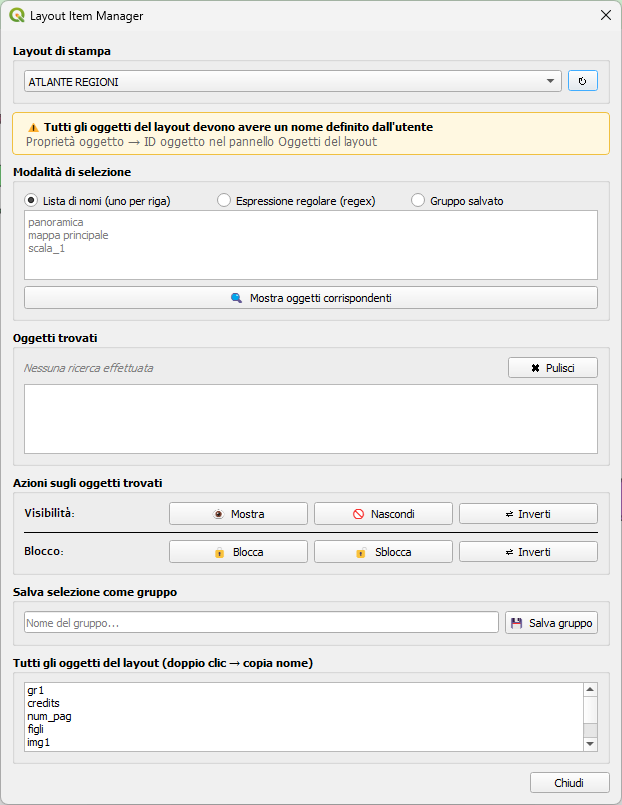

# Layout Item Manager

Un plugin QGIS per gestire la visibilità e lo stato di blocco degli oggetti nei layout di stampa.

## Descrizione

**Layout Item Manager** consente di selezionare e modificare rapidamente gli oggetti del layout di stampa (mappe, legende, scale, ecc.) per nome, espressione regolare o gruppo salvato. È possibile:

- **Mostrare/Nascondere** oggetti in massa
- **Bloccare/Sbloccare** oggetti in massa
- **Salvare selezioni** come gruppi riutilizzabili all'interno del progetto

## Requisiti

- **QGIS 3.20 o superiore**
- Python 3.6+

## Installazione

### Metodo 1: Repository QGIS ufficiale (quando disponibile)

1. In QGIS, vai a `Plugins → Gestisci e installa plugin`
2. Cerca "Layout Item Manager"
3. Fai clic su "Installa"

### Metodo 2: Installazione manuale

1. Scarica la cartella del plugin
2. Copiala in: `~/.local/share/QGIS/QGIS3/profiles/default/python/plugins/layout_item_manager` (Linux/macOS)
   - Su Windows: `C:\Users\<username>\AppData\Roaming\QGIS\QGIS3\profiles\default\python\plugins\layout_item_manager`
3. Riavvia QGIS
4. Attiva il plugin in `Plugins → Gestisci e installa plugin`

## Utilizzo

### 1. Apri il plugin

Vai a `Plugins → &Layout Item Manager → Gestisci Oggetti Layout`

### 2. Seleziona un layout

Scegli il layout di stampa dalla lista a discesa. Il plugin mostrerà tutti gli oggetti disponibili.

### 3. Scegli una modalità di selezione

#### Modalità "Lista di nomi"
- Inserisci i nomi degli oggetti (uno per riga)
- I nomi devono corrispondere esattamente all'**ID oggetto** definito nelle proprietà

#### Modalità "Espressione regolare"
- Inserisci un pattern regex
- Es: `mappa.*` seleziona tutti gli oggetti che iniziano con "mappa"
- Es: `(scala|legenda)` seleziona oggetti contenenti "scala" o "legenda"

#### Modalità "Gruppo salvato"
- Scegli un gruppo precedentemente salvato
- Puoi eliminare gruppi con il pulsante 🗑

### 4. Anteprima

Fai clic su "🔍 Mostra oggetti corrispondenti" per vedere quali oggetti corrisponderanno alle tue selezioni.

### 5. Applica azioni

#### Visibilità
- **👁 Mostra**: Rende visibili tutti gli oggetti trovati
- **🚫 Nascondi**: Nasconde tutti gli oggetti trovati
- **⇄ Inverti**: Commuta lo stato di visibilità

#### Blocco
- **🔒 Blocca**: Blocca tutti gli oggetti (non modificabili nel layout)
- **🔓 Sblocca**: Sblocca tutti gli oggetti
- **⇄ Inverti**: Commuta lo stato di blocco

### 6. Salva come gruppo

Se una selezione è utile, salvala come gruppo:
1. Inserisci un nome nel campo "Salva selezione come gruppo"
2. Fai clic su "💾 Salva gruppo"

Il gruppo sarà salvato nel progetto QGIS e disponibile nella modalità "Gruppo salvato".

## ⚠️ Prerequisiti importanti

**Tutti gli oggetti del layout devono avere un nome definito (ID oggetto):**

1. Nel layout, fai clic su un oggetto
2. Nel pannello "Oggetti del layout" (a sinistra), vedi il campo "ID oggetto"
3. Assegna un nome univoco all'oggetto (es: "mappa_principale", "legenda", "scala_1")

Senza nomi, il plugin non potrà individuare gli oggetti.

## Esempi di uso

### Esempio 1: Mostrare solo la mappa principale
1. Seleziona modalità "Lista di nomi"
2. Scrivi: `mappa_principale`
3. Fai clic su "🔍 Mostra oggetti corrispondenti"
4. Fai clic su "🚫 Nascondi" (per nascondere tutto il resto)
5. Seleziona solo `mappa_principale` in lista mode
6. Fai clic su "👁 Mostra"

### Esempio 2: Bloccare tutte le legende
1. Seleziona modalità "Espressione regolare"
2. Scrivi: `legenda.*`
3. Fai clic su "🔍 Mostra oggetti corrispondenti"
4. Fai clic su "🔒 Blocca"

### Esempio 3: Salvare uno stato comune
1. Configura le visibilità desiderate con una delle tre modalità
2. Dopo aver visualizzato l'anteprima, scrivi un nome (es: "Layout Stampa A4")
3. Fai clic su "💾 Salva gruppo"
4. La prossima volta, seleziona il gruppo salvato e applica le azioni

## Funzionamento interno

### Persistenza dei gruppi

I gruppi salvati vengono memorizzati come variabili di progetto QGIS con il prefisso `layout_gruppo_`. Quando salvi il progetto `.qgs`, i gruppi vengono salvati insieme.

### Stato di visibilità e blocco

Lo stato di visibilità e blocco è una proprietà dell'oggetto layout stesso e viene salvato nel file `.qgs`.

## Risoluzione dei problemi

**Problema**: "Nessun oggetto trovato"
- **Soluzione**: Verifica che gli oggetti del layout abbiano nomi (ID oggetto) definiti

**Problema**: La regex non funziona
- **Soluzione**: Usa la corretta sintassi regex Python. Consulta la documentazione di Python `re` module

**Problema**: I gruppi scompaiono dopo aver salvato il progetto
- **Soluzione**: Verifica di salvare il file `.qgs` per persistere i dati del plugin

## Bug e Segnalazioni

Se trovi un bug o hai suggerimenti, segnalalo su:
- [GitHub Issues](https://github.com/user/layout_item_manager/issues)

## Licenza

Vedi il file LICENSE (se presente).

## Autore

Totò

---

**Nota**: Questo plugin è in versione **sperimentale** (0.1). Usa con cautela in ambienti di produzione.
